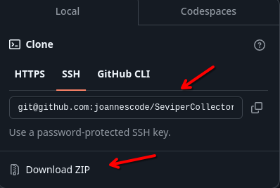

# Seviper Collector

Seviper é uma ferramenta escrita em Python para navegação e coleta de dados em servidores FTP.

## 💻 Guia de uso

As instruções abaixo permitirão que você obtenha uma cópia do projeto para uso, desenvolvimento e ou testes.

### 📋 Pré-requisitos
- Python3 
- Ambiente de Desenvolvimento 
- Conexão com internet
- Endereço de host do servidor FTP
- Número de porta do servidor FTP (não obrigatório)
- Usuário de acesso do servidor FTP (não obrigatório)
- Senha de usuário do servidor FTP (não obrigatório)

### 📥 Instalação da ferramenta
Basta passar o comando abaixo em seu terminal dentro de uma pasta de sua escolha.

`git clone git@github.com:joannescode/SeviperCollectorFTP.git`

Ou se preferir, baixar o repositório como .zip.

### 🤖 Executando a ferramenta
Siga o passo a passo abaixo para executar o main.py corretamente:

- Executar o main.py via terminal ou dentro do ambiente de desenvolvimento
- Responder os parâmetros necessários, sendo forma de download, profundidade de navegação, informações para conexão e autenticação.

*Demonstração da ferramenta:*

### 🛠️ Desenvolvido em/com
- Python3
- FTPLib
- Logging
- Os
  

*Desenvolvido inicialmente por [joannescode](https://github.com/joannescode) 💻*
